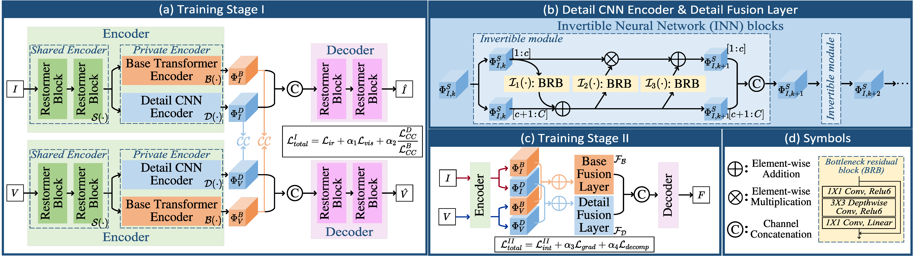
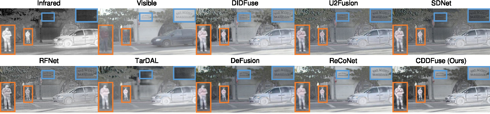
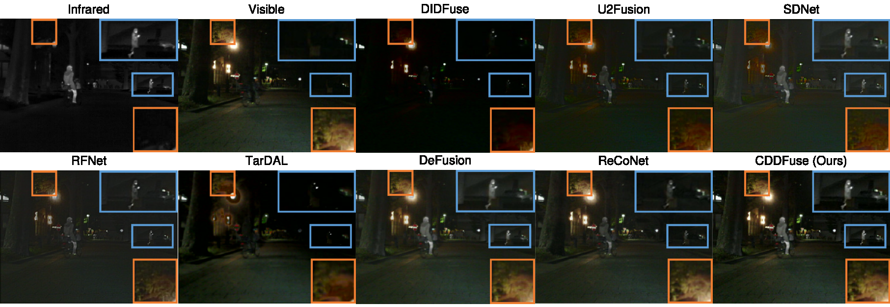
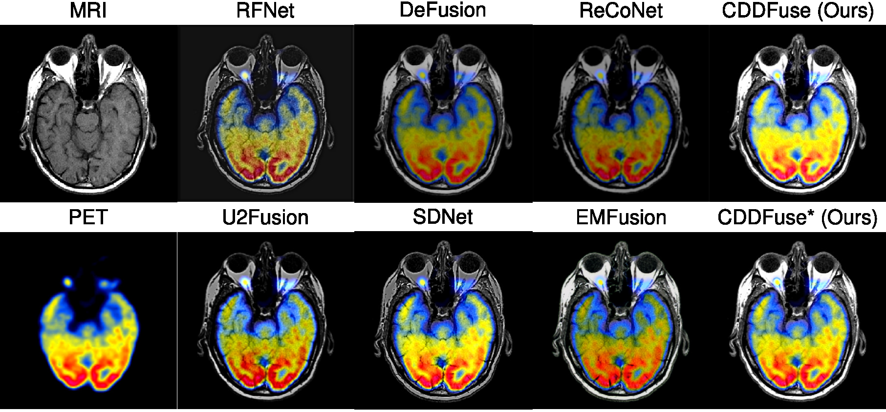
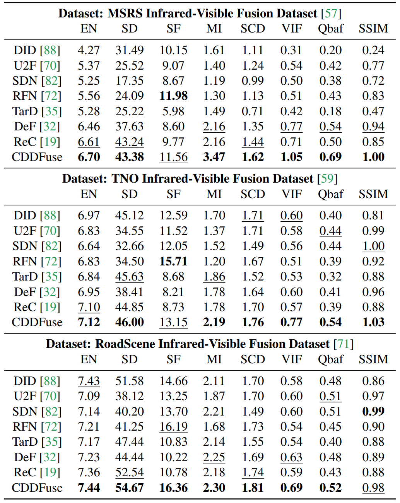
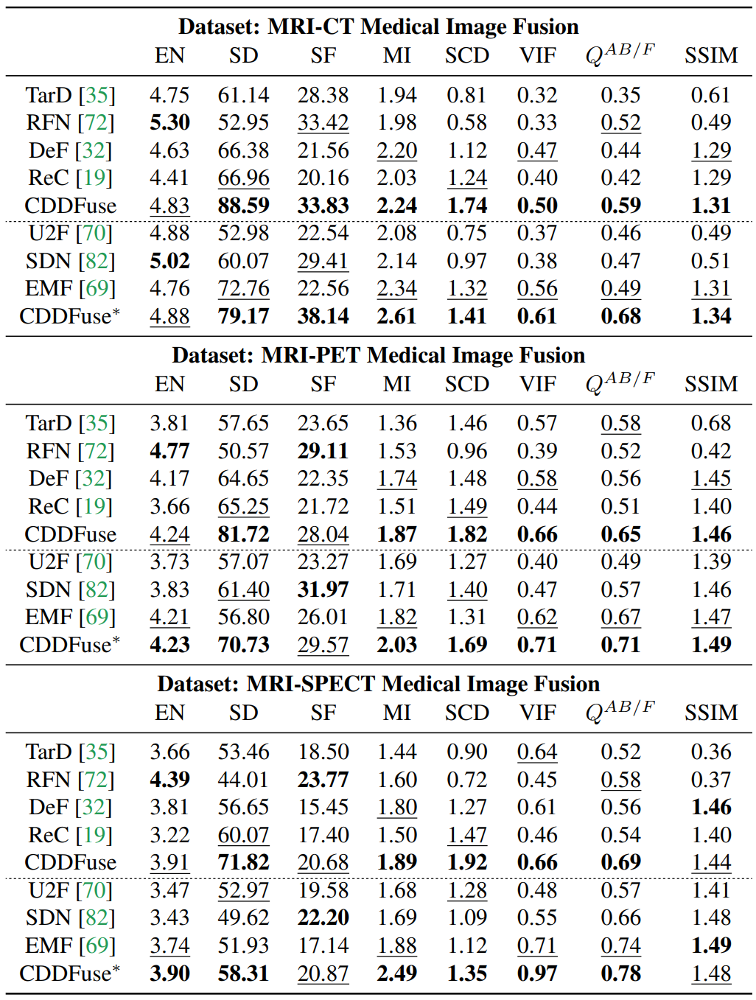
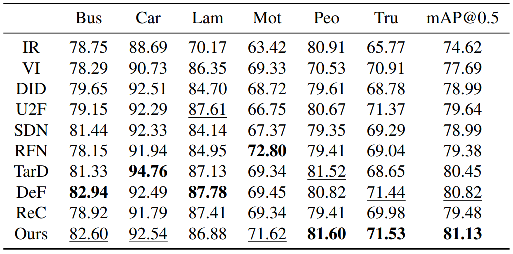
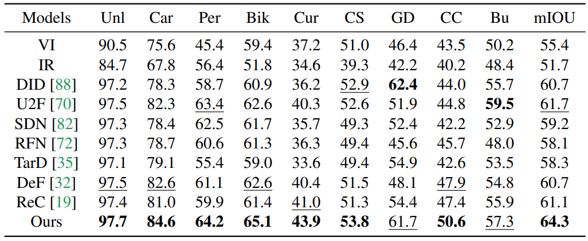

# CDDFuse
Codes for ***CDDFuse: Correlation-Driven Dual-Branch Feature Decomposition for Multi-Modality Image Fusion. (CVPR 2023)***

[Zixiang Zhao](https://zhaozixiang1228.github.io/), [Haowen Bai](), [Jiangshe Zhang](http://gr.xjtu.edu.cn/web/jszhang), [Yulun Zhang](https://yulunzhang.com/), [Shuang Xu](https://shuangxu96.github.io/), [Zudi Lin](https://zudi-lin.github.io/), [Radu Timofte](https://www.informatik.uni-wuerzburg.de/computervision/home/) and [Luc Van Gool](https://vision.ee.ethz.ch/people-details.OTAyMzM=.TGlzdC8zMjQ4LC0xOTcxNDY1MTc4.html).

-[*[Paper]*](https://openaccess.thecvf.com/content/CVPR2023/html/Zhao_CDDFuse_Correlation-Driven_Dual-Branch_Feature_Decomposition_for_Multi-Modality_Image_Fusion_CVPR_2023_paper.html)  
-[*[ArXiv]*](https://arxiv.org/abs/2104.06977)  
-[*[Supplementary Materials]*](https://openaccess.thecvf.com/content/CVPR2023/supplemental/Zhao_CDDFuse_Correlation-Driven_Dual-Branch_CVPR_2023_supplemental.pdf)  


## Update
- [2023/6] Training codes and config files are public available.
- [2023/4] Release inference code for infrared-visible image fusion and medical image fusion.


## Citation

```
@InProceedings{Zhao_2023_CVPR,
    author    = {Zhao, Zixiang and Bai, Haowen and Zhang, Jiangshe and Zhang, Yulun and Xu, Shuang and Lin, Zudi and Timofte, Radu and Van Gool, Luc},
    title     = {CDDFuse: Correlation-Driven Dual-Branch Feature Decomposition for Multi-Modality Image Fusion},
    booktitle = {Proceedings of the IEEE/CVF Conference on Computer Vision and Pattern Recognition (CVPR)},
    month     = {June},
    year      = {2023},
    pages     = {5906-5916}
}
```

## Abstract

Multi-modality (MM) image fusion aims to render fused images that maintain the merits of different modalities, e.g., functional highlight and detailed textures. To tackle the challenge in modeling cross-modality features and decomposing desirable modality-specific and modality-shared features, we propose a novel Correlation-Driven feature Decomposition Fusion (CDDFuse) network. Firstly, CDDFuse uses Restormer blocks to extract cross-modality shallow features. We then introduce a dual-branch Transformer-CNN feature extractor with Lite Transformer (LT) blocks leveraging long-range attention to handle low-frequency global features and Invertible Neural Networks (INN) blocks focusing on extracting high-frequency local information. A correlation-driven loss is further proposed to make the low-frequency features correlated while the high-frequency features uncorrelated based on the embedded information. Then, the LT-based global fusion and INN-based local fusion layers output the fused image. Extensive experiments demonstrate that our CDDFuse achieves promising results in multiple fusion tasks, including infrared-visible image fusion and medical image fusion. We also show that CDDFuse can boost the performance in downstream infrared-visible semantic segmentation and object detection in a unified benchmark.

## 🌐 Usage

### ⚙ Network Architecture

Our CDDFuse is implemented in ``net.py``.

### 🏊 Training
**1. Virtual Environment**
```
# create virtual environment
conda create -n cddfuse python=3.8.10
conda activate cddfuse
# select pytorch version yourself
# install cddfuse requirements
pip install -r requirements.txt
```

**2. Data Preparation**

Download the MSRS dataset from [this link](https://github.com/Linfeng-Tang/MSRS) and place it in the folder ``'./MSRS_train/'``.

**3. Pre-Processing**

Run 
```
python dataprocessing.py
``` 
and the processed training dataset is in ``'./data/MSRS_train_imgsize_128_stride_200.h5'``.

**4. CDDFuse Training**

Run 
```
python train.py
``` 
and the trained model is available in ``'./models/'``.

### 🏄 Testing

**1. Pretrained models**

Pretrained models are available in ``'./models/CDDFuse_IVF.pth'`` and ``'./models/CDDFuse_MIF.pth'``, which are responsible for the Infrared-Visible Fusion (IVF) and Medical Image Fusion (MIF) tasks, respectively. 

**2. Test datasets**

The test datasets used in the paper have been stored in ``'./test_img/RoadScene'``, ``'./test_img/TNO'`` for IVF, ``'./test_img/MRI_CT'``, ``'./test_img/MRI_PET'`` and ``'./test_img/MRI_SPECT'`` for MIF.

Unfortunately, since the size of **MSRS dataset** for IVF is 500+MB, we can not upload it for exhibition. It can be downloaded via [this link](https://github.com/Linfeng-Tang/MSRS). The other datasets contain all the test images.

**3. Results in Our Paper**

If you want to infer with our CDDFuse and obtain the fusion results in our paper, please run 
```
python test_IVF.py
``` 
for Infrared-Visible Fusion and 
```
python test_MIF.py
``` 
for Medical Image Fusion. 

The testing results will be printed in the terminal. 

The output for ``'test_IVF.py'`` is:

```
================================================================================
The test result of TNO :
                 EN      SD      SF      MI     SCD     VIF     Qabf    SSIM
CDDFuse         7.12    46.0    13.15   2.19    1.76    0.77    0.54    1.03
================================================================================

================================================================================
The test result of RoadScene :
                 EN      SD      SF      MI     SCD     VIF     Qabf    SSIM
CDDFuse         7.44    54.67   16.36   2.3     1.81    0.69    0.52    0.98
================================================================================
```
which can match the results in Table 1 in our original paper.

The output for ``'test_MIF.py'`` is:

```
================================================================================
The test result of MRI_CT :
                 EN      SD      SF      MI     SCD     VIF     Qabf    SSIM
CDDFuse_IVF     4.83    88.59   33.83   2.24    1.74    0.5     0.59    1.31
CDDFuse_MIF     4.88    79.17   38.14   2.61    1.41    0.61    0.68    1.34
================================================================================

================================================================================
The test result of MRI_PET :
                 EN      SD      SF      MI     SCD     VIF     Qabf    SSIM
CDDFuse_IVF     4.23    81.69   28.04   1.87    1.82    0.66    0.65    1.46
CDDFuse_MIF     4.22    70.74   29.57   2.03    1.69    0.71    0.71    1.49
================================================================================

================================================================================
The test result of MRI_SPECT :
                 EN      SD      SF      MI     SCD     VIF     Qabf    SSIM
CDDFuse_IVF     3.91    71.81   20.66   1.9     1.87    0.65    0.68    1.45
CDDFuse_MIF     3.9     58.31   20.87   2.49    1.35    0.97    0.78    1.48
================================================================================
```
which can match the results in Table 5 in our original paper.

## 🙌 CDDFuse

### Illustration of our CDDFuse model.



### Qualitative fusion results.







### Quantitative fusion results.

Infrared-Visible Image Fusion



Medical Image Fusion



MM detection



MM segmentation




## 📖 Related Work

- Zixiang Zhao, Haowen Bai, Jiangshe Zhang, Yulun Zhang, Kai Zhang, Shuang Xu, Dongdong Chen, Radu Timofte, Luc Van Gool. *Equivariant Multi-Modality Image Fusion.* **arXiv:2305.11443**, https://arxiv.org/abs/2305.11443

- Zixiang Zhao, Haowen Bai, Yuanzhi Zhu, Jiangshe Zhang, Shuang Xu, Yulun Zhang, Kai Zhang, Deyu Meng, Radu Timofte, Luc Van Gool.
*DDFM: Denoising Diffusion Model for Multi-Modality Image Fusion.* **ICCV 2023**, https://arxiv.org/abs/2303.06840

- Zixiang Zhao, Shuang Xu, Chunxia Zhang, Junmin Liu, Jiangshe Zhang and Pengfei Li. *DIDFuse: Deep Image Decomposition for Infrared and Visible Image Fusion.* **IJCAI 2020**, https://www.ijcai.org/Proceedings/2020/135.

- Zixiang Zhao, Shuang Xu, Jiangshe Zhang, Chengyang Liang, Chunxia Zhang and Junmin Liu. *Efficient and Model-Based Infrared and Visible Image Fusion via Algorithm Unrolling.* **IEEE Transactions on Circuits and Systems for Video Technology 2021**, https://ieeexplore.ieee.org/document/9416456.

- Zixiang Zhao, Jiangshe Zhang, Haowen Bai, Yicheng Wang, Yukun Cui, Lilun Deng, Kai Sun, Chunxia Zhang, Junmin Liu, Shuang Xu. *Deep Convolutional Sparse Coding Networks for Interpretable Image Fusion.* **CVPR Workshop 2023**. https://robustart.github.io/long_paper/26.pdf.

- Zixiang Zhao, Shuang Xu, Chunxia Zhang, Junmin Liu, Jiangshe Zhang. *Bayesian fusion for infrared and visible images.* **Signal Processing**, https://doi.org/10.1016/j.sigpro.2020.107734.

